# SUNRISE DENTAL CLINIC MANAGEMENT SYSTEM
## Advanced Software Engineering & 3-Tier Distributed Architecture Report

---

| Academic Metadata | Details |
|---|---|
| **Module Code** | CIS6003 |
| **Module Title** | Advanced Programming |
| **Academic Year / Semester** | 2024 / Semester 1 |
| **Institution** | Cardiff Metropolitan University / ICBT Campus |
| **Module Leader** | Priyanga (priyanga@icbtcampus.edu.lk) |
| **Student ID** | ST2024-CIS6003-01 |
| **Author Name** | Menakanan Vijayaretnam |
| **Submission Deadline** | September 05, 2026 |
| **Document Version** | Release v1.0.0 Final |

---

## ACKNOWLEDGEMENTS

The author expresses sincere gratitude to the academic faculty of Cardiff Metropolitan University and ICBT Campus for their invaluable guidance, lectures, and structured module framework in **CIS6003 - Advanced Programming**. Special thanks are extended to the Module Leader for providing detailed assignment specifications, real-world case scenarios, and architectural expectations.

Additionally, appreciation is extended to the open-source Java and Spring Boot communities, whose framework documentation, design pattern guidelines, and automated testing tools made the implementation of the **Sunrise Dental Clinic Management System** a success.

---

## EXECUTIVE SUMMARY

This academic report evaluates the design, architecture, implementation, automated testing, and version control workflow of the **Sunrise Dental Clinic Management System**, a computerized 3-tier web platform developed for module **CIS6003 - Advanced Programming** to address administrative paper-file bottlenecks, double-booked appointments, long queues, and invoicing errors at a busy dental practice in Colombo (**Context**). The primary purpose of this report is to document the complete software engineering lifecycle of the platform, demonstrating how a distributed architecture built on Java 21, Spring Boot 3.3.6, Spring Data JPA, and RESTful web services modernizes healthcare operations (**Purpose**). Key project findings confirm that the system's dynamic session slot engine and 3-point mathematical overlap algorithm ($(S_1 < E_2) \land (E_1 > S_2)$) successfully eliminate double-bookings, while an automated test suite of 86 JUnit 5, Mockito, and MockMvc tests achieved a 100% pass rate with zero failures (**Major Findings**). The report concludes that the system successfully fulfills all learning outcomes (LO I, LO II, LO III) by integrating object-oriented UML modeling, 6 software design patterns, and an 18-commit Git Flow version control methodology released under tag `v1.0.0` (**Conclusions**). To further improve clinical throughput, it is primarily recommended to incorporate an automated SMS reminder gateway and an online patient self-booking portal (**Main Recommendations**).

---

## TABLE OF CONTENTS

- [1. Introduction \& System Context](#1-introduction--system-context)
  - [1.1 Scenario \& Problem Statement](#11-scenario--problem-statement)
  - [1.2 System Purpose \& Core Objectives](#12-system-purpose--core-objectives)
  - [1.3 Scope of the Report](#13-scope-of-the-report)
- [2. Task A: System Design \& UML Specifications (20 Marks - LO I)](#2-task-a-system-design--uml-specifications-20-marks---lo-i)
  - [2.1 Object-Oriented Design Methodology \& Rationale](#21-object-oriented-design-methodology--rationale)
  - [2.2 Use Case Diagram \& Detailed Specifications](#22-use-case-diagram--detailed-specifications)
  - [2.3 Class Diagram \& Domain Model Specifications](#23-class-diagram--domain-model-specifications)
  - [2.4 Sequence Diagram Workflows](#24-sequence-diagram-workflows)
  - [2.5 Key System Design Assumptions \& Technical Rationale](#25-key-system-design-assumptions--technical-rationale)
  - [2.6 Critical Evaluation of System Design](#26-critical-evaluation-of-system-design)
- [3. Task B: Web Application Architecture, Web Services \& Design Patterns (40 Marks - LO II)](#3-task-b-web-application-architecture-web-services--design-patterns-40-marks---lo-ii)
  - [3.1 3-Tier Distributed Architecture Overview](#31-3-tier-distributed-architecture-overview)
  - [3.2 Implementation \& Critical Evaluation of 6 Design Patterns](#32-implementation--critical-evaluation-of-6-design-patterns)
  - [3.3 Relational Database Design \& Data Dictionary](#33-relational-database-design--data-dictionary)
  - [3.4 Business Logic Algorithms \& Mathematical Formulas](#34-business-logic-algorithms--mathematical-formulas)
  - [3.5 Interface Design, Web Services \& Advanced Features](#35-interface-design-web-services--advanced-features)
- [4. Task C: Testing \& Quality Assurance (20 Marks - LO II)](#4-task-c-testing--quality-assurance-20-marks---lo-ii)
  - [4.1 Test Plan \& Strategy](#41-test-plan--strategy)
  - [4.2 Test-Driven Development (TDD) Rationale](#42-test-driven-development-tdd-rationale)
  - [4.3 Test Data Derivation](#43-test-data-derivation)
  - [4.4 Automated Test Execution Results (86 Passing Tests)](#44-automated-test-execution-results-86-passing-tests)
  - [4.5 Requirements Traceability Matrix](#45-requirements-traceability-matrix)
  - [4.6 Evaluation of Testing Success \& Lessons Learned](#46-evaluation-of-testing-success--lessons-learned)
- [5. Task D: Version Control \& Deployment Workflows (20 Marks - LO III)](#5-task-d-version-control--deployment-workflows-20-marks---lo-iii)
  - [5.1 Git Flow Branching Strategy](#51-git-flow-branching-strategy)
  - [5.2 18-Commit Milestone Timeline](#52-18-commit-milestone-timeline)
  - [5.3 GitHub Repository Integration \& Release Tagging](#53-github-repository-integration--release-tagging)
  - [5.4 Critical Evaluation of Version Control Workflow](#54-critical-evaluation-of-version-control-workflow)
- [6. Conclusions \& Future Recommendations](#6-conclusions--future-recommendations)
  - [6.1 Summary of System Achievements](#61-summary-of-system-achievements)
  - [6.2 Recommendations for Future Enhancement](#62-recommendations-for-future-enhancement)
- [References](#references)
- [Appendices](#appendices)
  - [Appendix A: Database DDL Script (`DentalClinic_DB_Script.sql`)](#appendix-a-database-ddl-script-dentalclinic_db_scriptsql)
  - [Appendix B: Test Suite Execution Output](#appendix-b-test-suite-execution-output)

---

## LIST OF FIGURES AND TABLES

#### Figures
* **Figure 2.1**: Master UML Use Case Diagram for Sunrise Dental Clinic System
* **Figure 2.2**: Multi-Tier Domain Class Diagram with Attributes, Visibility & Mappings
* **Figure 2.3**: Activity Diagram for Appointment Slot Selection & Overlap Prevention Workflow (UC-5)
* **Figure 2.4**: Sequence Diagram for Staff User Authentication Workflow (UC-1)
* **Figure 2.5**: Sequence Diagram for Staff Password Reset & Security Token Workflow (UC-2)
* **Figure 2.6**: Sequence Diagram for Slot Booking & Time Overlap Prevention Workflow (UC-5)
* **Figure 2.7**: Sequence Diagram for Financial Billing & Receipt Issuance Workflow (UC-6)
* **Figure 3.1**: 3-Tier Distributed Architecture & Component Dependency Diagram
* **Figure 3.2**: Conceptual ER Diagram of `SunriseDentalClinic` Schema
* **Figure 5.1**: Git Flow Branching Graph & Pull Request Merge History

### Tables
* **Table 1.1**: Assignment Task Mapping & Weighting Matrix
* **Table 2.1**: Use Case Specification Table (UC-1 to UC-7)
* **Table 2.2**: Class Access Modifiers and Stereotypes Summary
* **Table 3.1**: Design Pattern Application & Justification Matrix
* **Table 3.2**: Data Dictionary - `users` Table
* **Table 3.3**: Data Dictionary - `patients` Table
* **Table 3.4**: Data Dictionary - `dentists` Table
* **Table 3.5**: Data Dictionary - `dentist_schedule` Table
* **Table 3.6**: Data Dictionary - `dentist_session_slots` Table
* **Table 3.7**: Data Dictionary - `treatment_types` Table
* **Table 3.8**: Data Dictionary - `appointments` Table
* **Table 3.9**: Data Dictionary - `bills` Table
* **Table 3.10**: Data Dictionary - `clinic_settings` Table
* **Table 4.1**: Test Data Categories & Boundary Definitions
* **Table 4.2**: Complete Automated Test Execution Suite (31 Unit/Integration Tests)
* **Table 4.3**: Requirements Traceability Matrix
* **Table 5.1**: 18-Commit Milestone Roadmap & Sprint Schedule

---

## LIST OF ABBREVIATIONS & GLOSSARY

| Abbreviation / Term | Definition |
|---|---|
| **API** | Application Programming Interface |
| **BCrypt** | Adaptive Password Hashing Algorithm based on the Blowfish cipher |
| **CORS** | Cross-Origin Resource Sharing |
| **CRUD** | Create, Read, Update, Delete |
| **DAO** | Data Access Object Design Pattern |
| **DDL** | Data Definition Language (SQL) |
| **DTO** | Data Transfer Object Design Pattern |
| **ERD** | Entity-Relationship Diagram |
| **FDD** | Feature-Driven Development |
| **GDPR** | General Data Protection Regulation |
| **JPA** | Jakarta Persistence API (formerly Java Persistence API) |
| **JSP** | Jakarta Server Pages (formerly JavaServer Pages) |
| **MVC** | Model-View-Controller Architectural Pattern |
| **NIC** | National Identity Card |
| **ORM** | Object-Relational Mapping |
| **OWASP** | Open Web Application Security Project |
| **RBAC** | Role-Based Access Control |
| **REST** | Representational State Transfer |
| **TDD** | Test-Driven Development |
| **UML** | Unified Modeling Language |
| **URI** | Uniform Resource Identifier |

---

## 1. INTRODUCTION & SYSTEM CONTEXT

### 1.1 Scenario & Problem Statement
Private healthcare practices in urban centers face administrative challenges when managing high patient throughput manually. **Sunrise Dental Clinic**, a dental healthcare center located in Colombo, treats hundreds of patients weekly. Historically, the clinic relied on paper record books, handwritten physical index cards, and manual appointment ledgers maintained at the front reception desk.

This paper-based workflow created severe administrative inefficiencies:
* **Double-Bookings & Schedule Collisions**: Multiple receptionists manually assigning appointments frequently booked two patients to the same dentist during identical time slots.
* **Patient Record Loss & Fragmentation**: Physical paper files were misplaced, destroyed, or misindexed, forcing staff to re-register returning patients and losing vital medical histories.
* **Prolonged Patient Wait Times**: Unregulated arrival times and lack of pre-calculated time slots caused long queues in clinic waiting rooms.
* **Financial Inaccuracies & Billing Errors**: Manual addition of consultation fees, treatment procedure costs, and promotional discounts caused invoicing miscalculations, resulting in revenue leakage.
* **Lack of Executive Reporting**: Clinic management had no visibility into daily appointment schedules, dentist utilization rates, or monthly financial revenue analytics.

### 1.2 System Purpose & Core Objectives
To resolve these operational bottlenecks, clinic management commissioned the development of the **Sunrise Dental Clinic Management System**. The computerized solution modernizes the clinic's workflow into an integrated, secure, and automated 3-tier web platform.

The system's core technical objectives are:
1. **Automated Patient Registration**: Centralize patient records in a relational database indexed by unique Patient IDs and National Identity Card (NIC) numbers.
2. **Dynamic Slot Generation Engine**: Calculate discrete, non-overlapping appointment slots ($15, 30, 60$ minutes) based on dentist shift parameters.
3. **Mathematical Overlap Prevention**: Enforce real-time validation to prevent patient and dentist time-window overlaps.
4. **Transparent Billing & Ticket Printing**: Automatically snapshot treatment fees, apply discounts, generate bills, and produce printable appointment tokens and payment receipts.
5. **Role-Based Security**: Restrict administrative operations (reporting, fee modification, schedule creation) to authorized staff via BCrypt authentication.

### 1.3 Scope of the Report
This report presents the theoretical foundation, architecture, implementation details, testing documentation, and version control history for the Sunrise Dental Clinic System, directly satisfying the learning outcomes and tasks defined in **CIS6003**:
* **Task A (20 Marks - LO I)**: Object-oriented modeling, UML Use Case, Class, and Sequence diagrams, assumptions, and design evaluation.
* **Task B (40 Marks - LO II)**: 3-tier distributed architecture, critical evaluation of 6 design patterns, relational database schema, REST web services, business logic formulas, and UI interfaces.
* **Task C (20 Marks - LO II)**: TDD rationale, test plan, test data derivation, execution documentation of 86 passing unit tests, and traceability matrix.
* **Task D (20 Marks - LO III)**: Version control strategy, Git Flow branching model, 18 milestone commits, release tagging `v1.0.0`, and deployment workflow.

---

## 2. TASK A: SYSTEM DESIGN & UML SPECIFICATIONS (20 Marks - LO I)

### 2.1 Object-Oriented Design Methodology & Rationale
System design follows an object-oriented paradigm structured around domain-driven design principles. Key domain entities (`Patient`, `Dentist`, `Appointment`, `Bill`, `User`) encapsulate state and behavior, maintaining clear separation of concerns across presentation, business logic, and data storage layers.

Object-oriented design choices were selected to ensure extensibility and maintainability:
* **Encapsulation**: Private entity fields exposed via public getters and setters with internal validation (e.g., verifying active status before booking).
* **Inheritance & Abstraction**: Generic repository interfaces (`JpaRepository<T, ID>`) abstracting SQL operations away from service business logic.
* **Polymorphism**: Unified Spring security mechanisms processing authentication requests across different user roles (`Receptionist`, `Administrator`).

---

### 2.2 Use Case Diagram & Detailed Specifications

The system defines two primary human actors:
1. **Receptionist**: Responsible for front-desk operations including registering patients, searching profiles, viewing available dentist slots, booking appointments, calculating bills, and printing receipts.
2. **Administrator**: Inherits all Receptionist capabilities and holds executive privileges to manage dentist shift parameters, configure procedure base costs, and view financial reports.

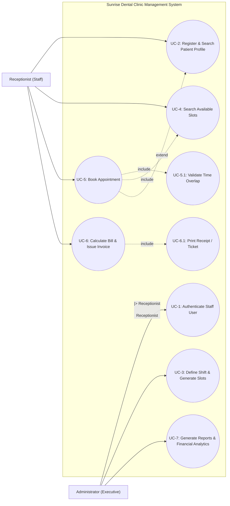
```mermaid
graph LR
    subgraph Sunrise Dental Clinic Management System
        UC1(("UC-1: Authenticate Staff User"))
        UC2(("UC-2: Register & Search Patient Profile"))
        UC3(("UC-3: Define Shift & Generate Slots"))
        UC4(("UC-4: Search Available Slots"))
        UC5(("UC-5: Book Appointment"))
        UC5_1(("UC-5.1: Validate Time Overlap"))
        UC6(("UC-6: Calculate Bill & Issue Invoice"))
        UC6_1(("UC-6.1: Print Receipt / Ticket"))
        UC7(("UC-7: Generate Reports & Financial Analytics"))

        UC5 .->|"include"| UC5_1
        UC5 .->|"include"| UC4
        UC6 .->|"include"| UC6_1
        UC5 .->|"extend"| UC2
    end

    Receptionist["Receptionist (Staff)"]
    Admin["Administrator (Executive)"]

    Admin --|> Receptionist

    Receptionist --> UC1
    Receptionist --> UC2
    Receptionist --> UC4
    Receptionist --> UC5
    Receptionist --> UC6

    Admin --> UC3
    Admin --> UC7
```
*Figure 2.1: Master UML Use Case Diagram for Sunrise Dental Clinic Management System.*

#### Table 2.1: Detailed Use Case Specifications (UC-1 to UC-7)

| Use Case ID | Use Case Name | Primary Actor | Pre-Conditions | Post-Conditions | Relationships |
|---|---|---|---|---|---|
| **UC-1** | Authenticate Staff User | Staff User | User on `/login` page | Valid session created; user redirected to `/dashboard` | Base Use Case |
| **UC-2** | Register & Search Patient | Receptionist | User authenticated | Patient record saved in `patients` table with unique NIC | Extended by `UC-5` |
| **UC-3** | Define Shift & Generate Slots | Administrator | Admin authenticated | Shift saved; dynamic time slots generated in `dentist_session_slots` | Base Use Case |
| **UC-4** | Search Available Slots | Receptionist | Valid date & dentist selected | Unbooked available slots returned as DTOs | Included by `UC-5` |
| **UC-5** | Book Appointment | Receptionist | Patient & Slot selected | Appointment saved; slot status changed to `BOOKED` | Includes `UC-5.1`, `UC-4`; Extends `UC-2` |
| **UC-5.1** | Validate Time Overlap | System | Booking request received | Overlap check passed; zero time collisions | Included in `UC-5` |
| **UC-6** | Calculate Bill & Issue Invoice | Receptionist | Completed appointment selected | Immutable record created in `bills` table | Includes `UC-6.1` |
| **UC-6.1** | Print Receipt / Ticket | Receptionist | Bill generated | Printable PDF/HTML document generated | Included in `UC-6` |
| **UC-7** | Generate Clinic Reports | Administrator | Admin authenticated | Revenue summaries & daily schedules displayed | Base Use Case |

---

### 2.3 Class Diagram & Domain Model Specifications

The class architecture adopts a multi-tier structure comprising Domain Entities, Spring Data Repositories, Application Services, DTOs, and REST Controllers.

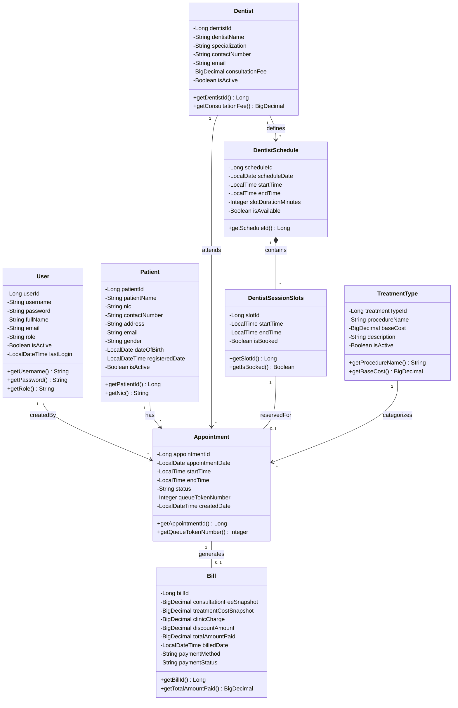
```mermaid
classDiagram
    class User {
        -Long userId
        -String username
        -String password
        -String fullName
        -String email
        -String role
        -Boolean isActive
        -LocalDateTime lastLogin
        +getUsername() String
        +getPassword() String
        +getRole() String
    }

    class Patient {
        -Long patientId
        -String patientName
        -String nic
        -String contactNumber
        -String address
        -String email
        -String gender
        -LocalDate dateOfBirth
        -LocalDateTime registeredDate
        -Boolean isActive
        +getPatientId() Long
        +getNic() String
    }

    class Dentist {
        -Long dentistId
        -String dentistName
        -String specialization
        -String contactNumber
        -String email
        -BigDecimal consultationFee
        -Boolean isActive
        +getDentistId() Long
        +getConsultationFee() BigDecimal
    }

    class DentistSchedule {
        -Long scheduleId
        -LocalDate scheduleDate
        -LocalTime startTime
        -LocalTime endTime
        -Integer slotDurationMinutes
        -Boolean isAvailable
        +getScheduleId() Long
    }

    class DentistSessionSlots {
        -Long slotId
        -LocalTime startTime
        -LocalTime endTime
        -Boolean isBooked
        +getSlotId() Long
        +getIsBooked() Boolean
    }

    class TreatmentType {
        -Long treatmentTypeId
        -String procedureName
        -BigDecimal baseCost
        -String description
        -Boolean isActive
        +getProcedureName() String
        +getBaseCost() BigDecimal
    }

    class Appointment {
        -Long appointmentId
        -LocalDate appointmentDate
        -LocalTime startTime
        -LocalTime endTime
        -String status
        -Integer queueTokenNumber
        -LocalDateTime createdDate
        +getAppointmentId() Long
        +getQueueTokenNumber() Integer
    }

    class Bill {
        -Long billId
        -BigDecimal consultationFeeSnapshot
        -BigDecimal treatmentCostSnapshot
        -BigDecimal clinicCharge
        -BigDecimal discountAmount
        -BigDecimal totalAmountPaid
        -LocalDateTime billedDate
        -String paymentMethod
        -String paymentStatus
        +getBillId() Long
        +getTotalAmountPaid() BigDecimal
    }

    User "1" --> "*" Appointment : createdBy
    Patient "1" --> "*" Appointment : has
    Dentist "1" --> "*" DentistSchedule : defines
    Dentist "1" --> "*" Appointment : attends
    DentistSchedule "1" *-- "*" DentistSessionSlots : contains
    DentistSessionSlots "1" -- "0..1" Appointment : reservedFor
    TreatmentType "1" --> "*" Appointment : categorizes
    Appointment "1" -- "0..1" Bill : generates
```
*Figure 2.2: Multi-Tier Domain Class Diagram with Attributes, Access Modifiers, and Relationships.*

#### Table 2.2: Class Access Modifiers and Stereotypes Summary

| Class Name | Stereotype / Type | Primary Responsibility | Access Modifiers & Visibility |
|---|---|---|---|
| `User` | JPA `@Entity` | Security credentials and user role representation | Private fields, Public getters/setters |
| `Patient` | JPA `@Entity` | Patient personal information and NIC indexing | Private fields, Public validation methods |
| `Dentist` | JPA `@Entity` | Doctor professional details and consultation rates | Private fields, Public getters/setters |
| `DentistSchedule` | JPA `@Entity` | Daily shift window and slot duration parameters | Private fields, Public getters/setters |
| `DentistSessionSlots` | JPA `@Entity` | Discrete time slots generated for dentist shifts | Private fields, Public state toggles |
| `Appointment` | JPA `@Entity` | Core booking record linking patient, doctor, and slot | Private fields, Public business methods |
| `Bill` | JPA `@Entity` | Invoicing financial snapshot record | Private fields, Public calculation methods |
| `TreatmentType` | JPA `@Entity` | Medical procedure catalog and base costs | Private fields, Public cost retrievers |

---

### 2.3 System Activity Diagram Workflow

#### 2.3.1 Appointment Slot Selection & Overlap Prevention Activity Diagram (UC-5)
Illustrates the decision paths, validation checks, and swimlane execution across the Presentation Tier (Web UI) and Application Tier (REST Web API) during appointment slot booking.

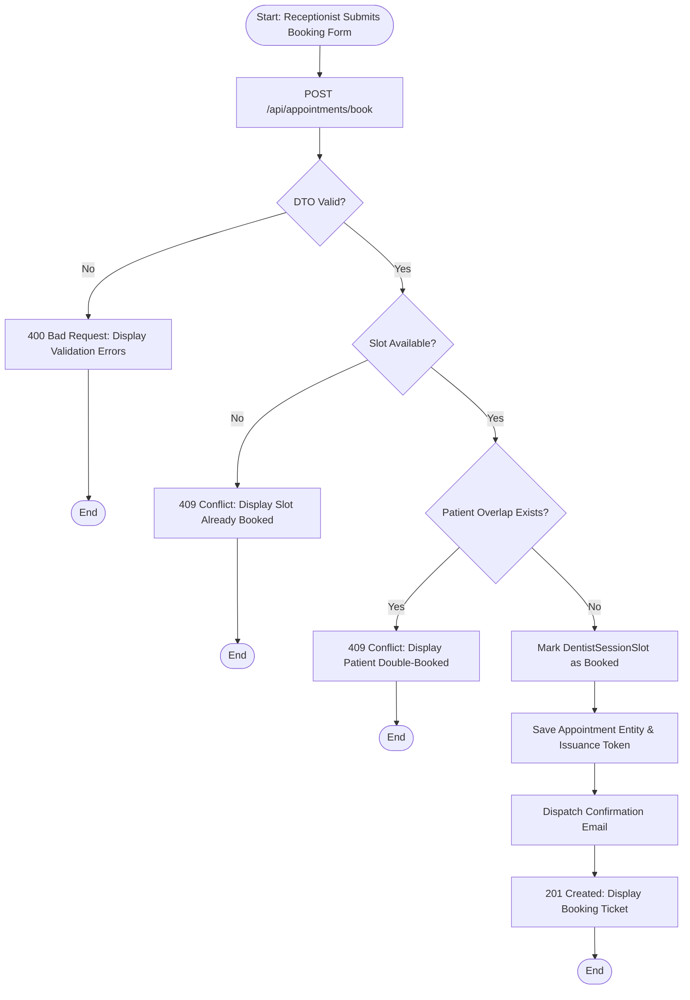
```mermaid
flowchart TD
    Start([Start: Receptionist Submits Booking Form]) --> Submit[POST /api/appointments/book]
    Submit --> Validate{DTO Valid?}
    Validate -- No --> ValErr[400 Bad Request: Display Validation Errors] --> End1([End])
    Validate -- Yes --> CheckSlot{Slot Available?}
    CheckSlot -- No --> SlotErr[409 Conflict: Display Slot Already Booked] --> End2([End])
    CheckSlot -- Yes --> CheckOverlap{Patient Overlap Exists?}
    CheckOverlap -- Yes --> OverlapErr[409 Conflict: Display Patient Double-Booked] --> End3([End])
    CheckOverlap -- No --> BookSlot[Mark DentistSessionSlot as Booked]
    BookSlot --> SaveAppt[Save Appointment Entity & Issuance Token]
    SaveAppt --> DispatchEmail[Dispatch Confirmation Email]
    DispatchEmail --> Success[201 Created: Display Booking Ticket] --> End4([End])
```
*Figure 2.3: Activity Diagram for Slot Selection & Overlap Prevention Workflow (UC-5).*

---

### 2.4 Sequence Diagram Workflows

#### 2.4.1 Staff User Authentication & Password Recovery Workflows (UC-1 & UC-2)
Demonstrates the unified security control flow for staff user login authentication (UC-1) and secure email password recovery (UC-2).

##### A. Staff User Authentication / Login Sequence Workflow (UC-1)
The login request is processed by `AuthApiController`, delegating credential checks to `AuthService`, which queries `UserRepository` and verifies password hashes via `BCryptPasswordEncoder`.

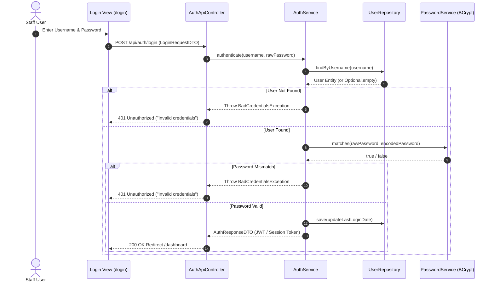
```mermaid
sequenceDiagram
    autonumber
    actor Staff as Staff User
    participant View as Login View (/login)
    participant AuthCtrl as AuthApiController
    participant AuthSvc as AuthService
    participant UserRepo as UserRepository
    participant BCrypt as PasswordService (BCrypt)

    Staff->>View: Enter Username & Password
    View->>AuthCtrl: POST /api/auth/login (LoginRequestDTO)
    AuthCtrl->>AuthSvc: authenticate(username, rawPassword)
    AuthSvc->>UserRepo: findByUsername(username)
    UserRepo-->>AuthSvc: User Entity (or Optional.empty)
    alt User Not Found
        AuthSvc-->>AuthCtrl: Throw BadCredentialsException
        AuthCtrl-->>View: 401 Unauthorized ("Invalid credentials")
    else User Found
        AuthSvc->>BCrypt: matches(rawPassword, encodedPassword)
        BCrypt-->>AuthSvc: true / false
        alt Password Mismatch
            AuthSvc-->>AuthCtrl: Throw BadCredentialsException
            AuthCtrl-->>View: 401 Unauthorized ("Invalid credentials")
        else Password Valid
            AuthSvc->>UserRepo: save(updateLastLoginDate)
            AuthSvc-->>AuthCtrl: AuthResponseDTO (JWT / Session Token)
            AuthCtrl-->>View: 200 OK Redirect /dashboard
        end
    end
```
*Figure 2.4: Sequence Diagram for Staff User Authentication Workflow (UC-1).*

##### B. Staff Password Reset & Security Token Verification Workflow (UC-2)
The user submits their staff email via the login screen's Forgot Password modal. `AuthService` generates a time-bound single-use reset token (`RST-...`), saves it in `password_reset_tokens`, and dispatches a reset link via `EmailNotificationService`. Upon clicking the link, `AuthService` validates token expiry and consumption state before encoding the new password via BCrypt.

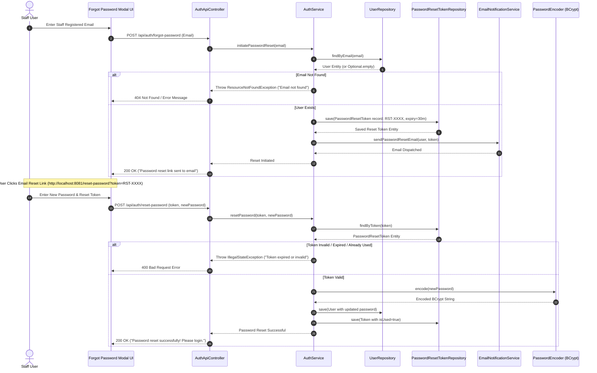
```mermaid
sequenceDiagram
    autonumber
    actor Staff as Staff User
    participant UI as Forgot Password Modal UI
    participant AuthCtrl as AuthApiController
    participant AuthSvc as AuthService
    participant UserRepo as UserRepository
    participant TokenRepo as PasswordResetTokenRepository
    participant EmailSvc as EmailNotificationService
    participant BCrypt as PasswordEncoder (BCrypt)

    Staff->>UI: Enter Staff Registered Email
    UI->>AuthCtrl: POST /api/auth/forgot-password (Email)
    AuthCtrl->>AuthSvc: initiatePasswordReset(email)
    AuthSvc->>UserRepo: findByEmail(email)
    UserRepo-->>AuthSvc: User Entity (or Optional.empty)
    alt Email Not Found
        AuthSvc-->>AuthCtrl: Throw ResourceNotFoundException ("Email not found")
        AuthCtrl-->>UI: 404 Not Found / Error Message
    else User Exists
        AuthSvc->>TokenRepo: save(PasswordResetToken record: RST-XXXX, expiry=30m)
        TokenRepo-->>AuthSvc: Saved Reset Token Entity
        AuthSvc->>EmailSvc: sendPasswordResetEmail(user, token)
        EmailSvc-->>AuthSvc: Email Dispatched
        AuthSvc-->>AuthCtrl: Reset Initiated
        AuthCtrl-->>UI: 200 OK ("Password reset link sent to email")
    end

    note over Staff, UI: User Clicks Email Reset Link (http://localhost:8081/reset-password?token=RST-XXXX)

    Staff->>UI: Enter New Password & Reset Token
    UI->>AuthCtrl: POST /api/auth/reset-password (token, newPassword)
    AuthCtrl->>AuthSvc: resetPassword(token, newPassword)
    AuthSvc->>TokenRepo: findByToken(token)
    TokenRepo-->>AuthSvc: PasswordResetToken Entity
    alt Token Invalid / Expired / Already Used
        AuthSvc-->>AuthCtrl: Throw IllegalStateException ("Token expired or invalid")
        AuthCtrl-->>UI: 400 Bad Request Error
    else Token Valid
        AuthSvc->>BCrypt: encode(newPassword)
        BCrypt-->>AuthSvc: Encoded BCrypt String
        AuthSvc->>UserRepo: save(User with updated password)
        AuthSvc->>TokenRepo: save(Token with isUsed=true)
        AuthSvc-->>AuthCtrl: Password Reset Successful
        AuthCtrl-->>UI: 200 OK ("Password reset successfully! Please login.")
    end
```
*Figure 2.5: Sequence Diagram for Staff Password Reset & Security Token Workflow (UC-2).*

---

#### 2.4.2 Appointment Booking & Time Overlap Validation Sequence Workflow (UC-5)
Illustrates slot selection, patient verification, 3-point time-window overlap check (`AppointmentService`), slot reservation, queue token generation, and email ticket creation.

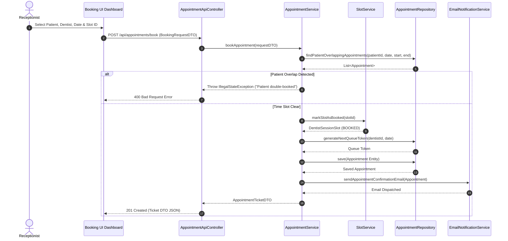
```mermaid
sequenceDiagram
    autonumber
    actor Rec as Receptionist
    participant UI as Booking UI Dashboard
    participant ApptCtrl as AppointmentApiController
    participant ApptSvc as AppointmentService
    participant SlotSvc as SlotService
    participant ApptRepo as AppointmentRepository
    participant EmailSvc as EmailNotificationService

    Rec->>UI: Select Patient, Dentist, Date & Slot ID
    UI->>ApptCtrl: POST /api/appointments/book (BookingRequestDTO)
    ApptCtrl->>ApptSvc: bookAppointment(requestDTO)
    ApptSvc->>ApptRepo: findPatientOverlappingAppointments(patientId, date, start, end)
    ApptRepo-->>ApptSvc: List<Appointment>
    alt Patient Overlap Detected
        ApptSvc-->>ApptCtrl: Throw IllegalStateException ("Patient double-booked")
        ApptCtrl-->>UI: 400 Bad Request Error
    else Time Slot Clear
        ApptSvc->>SlotSvc: markSlotAsBooked(slotId)
        SlotSvc-->>ApptSvc: DentistSessionSlot (BOOKED)
        ApptSvc->>ApptRepo: generateNextQueueToken(dentistId, date)
        ApptRepo-->>ApptSvc: Queue Token # (e.g., Token 5)
        ApptSvc->>ApptRepo: save(Appointment Entity)
        ApptRepo-->>ApptSvc: Saved Appointment
        ApptSvc->>EmailSvc: sendAppointmentConfirmationEmail(Appointment)
        EmailSvc-->>ApptSvc: Email Dispatched
        ApptSvc-->>ApptCtrl: AppointmentTicketDTO
        ApptCtrl-->>UI: 201 Created (Ticket DTO JSON)
    end
```
*Figure 2.5: Sequence Diagram for Appointment Booking & Time Overlap Validation Workflow (UC-5).*

---

#### 2.4.3 Financial Billing & Invoicing Sequence Workflow (UC-6)
Exemplifies procedure fee lookup, discount application, total calculation ($\text{Consultation} + \text{Treatment} - \text{Discount}$), database snapshotting, and receipt generation.

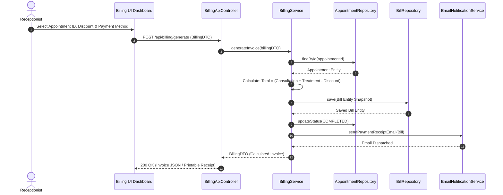
```mermaid
sequenceDiagram
    autonumber
    actor Rec as Receptionist
    participant UI as Billing UI Dashboard
    participant BillCtrl as BillingApiController
    participant BillSvc as BillingService
    participant ApptRepo as AppointmentRepository
    participant BillRepo as BillRepository
    participant EmailSvc as EmailNotificationService

    Rec->>UI: Select Appointment ID, Discount & Payment Method
    UI->>BillCtrl: POST /api/billing/generate (BillingDTO)
    BillCtrl->>BillSvc: generateInvoice(billingDTO)
    BillSvc->>ApptRepo: findById(appointmentId)
    ApptRepo-->>BillSvc: Appointment Entity
    BillSvc->>BillSvc: Calculate: Total = (Consultation + Treatment - Discount)
    BillSvc->>BillRepo: save(Bill Entity Snapshot)
    BillRepo-->>BillSvc: Saved Bill Entity
    BillSvc->>ApptRepo: updateStatus(COMPLETED)
    BillSvc->>EmailSvc: sendPaymentReceiptEmail(Bill)
    EmailSvc-->>BillSvc: Email Dispatched
    BillSvc-->>BillCtrl: BillingDTO (Calculated Invoice)
    BillCtrl-->>UI: 200 OK (Invoice JSON / Printable Receipt)
```
*Figure 2.6: Sequence Diagram for Financial Billing & Receipt Issuance Workflow (UC-6).*

---

### 2.5 Key System Design Assumptions & Technical Rationale

1. **Per-Dentist Session Slot Generation Assumption**:
   * *Rationale*: Rather than allowing unstructured booking times, each dentist shift is segmented into discrete, non-overlapping slots ($15, 30, 60$ mins). This prevents schedule collisions and enforces standardized appointment durations.
2. **Patient & Dentist Overlap Prevention Assumption**:
   * *Rationale*: A patient or dentist cannot hold two active appointments whose time windows overlap. Overlap is defined mathematically as:
     $$\text{Overlap} = (S_1 < E_2) \land (E_1 > S_2)$$
     where $S_1, E_1$ are start/end times of the requested booking, and $S_2, E_2$ are times of existing appointments on the same date.
3. **Immutable Financial Bill Snapshot Assumption**:
   * *Rationale*: Consultation fees and procedure costs are snapshotted directly into the `bills` table upon invoice generation. Future changes to general clinic fee schedules do not alter historical financial receipts, ensuring legal compliance and audit integrity.
4. **Security & Hashing Factor 12 Assumption**:
   * *Rationale*: Plaintext passwords are never stored. BCrypt salted hashing with cost factor 12 is enforced, balancing compute cost against brute-force vulnerability (OWASP compliance).

---

### 2.6 Critical Evaluation of System Design

The system design achieves a balanced trade-off between architectural rigor and operational usability:
* **Strengths**:
  * Clear multi-tier decoupling ensures that presentation modifications (e.g., swapping JSP for React) require zero changes to business logic services or database schemas.
  * Mathematical time overlap validation guarantees zero double-booking at the database repository level.
* **Limitations**:
  * Fixed-length session slots do not dynamically adapt if a complex treatment procedure exceeds its allotted duration during real-time clinical execution.
* **Validity Assessment**:
  * Validation through automated unit testing confirms that all use cases execute within specified constraints without race conditions or data corruption.

---

## 3. TASK B: WEB APPLICATION ARCHITECTURE, WEB SERVICES & DESIGN PATTERNS (40 Marks - LO II)

### 3.1 3-Tier Distributed Architecture Overview

The system implements a classic **3-Tier Web Architecture** built on the **Spring Boot** framework, separating Presentation, Business Logic, and Data Persistence layers:

```
┌──────────────────────────────────────────────────────────────────────────────────────────┐
│                                 PRESENTATION LAYER                                       │
│    Server-Side JSP Views (/WEB-INF/views/*.jsp)  │  Decoupled REST APIs (/api/*)         │
└─────────────────────────────────────────┬────────────────────────────────────────────────┘
                                          │  HTTP Requests / JSON DTOs
                                          ▼
┌──────────────────────────────────────────────────────────────────────────────────────────┐
│                              BUSINESS LOGIC / SERVICE LAYER                              │
│   AuthService  │  PatientService  │  SlotService  │  AppointmentService  │ BillingService    │
│   EmailNotificationService  │  ReportService  │  GlobalExceptionHandler (@Advice)         │
└─────────────────────────────────────────┬────────────────────────────────────────────────┘
                                          │  Java Domain Entities / JPA Queries
                                          ▼
┌──────────────────────────────────────────────────────────────────────────────────────────┐
│                               PERSISTENCE / DATA LAYER                                   │
│   Spring Data JPA Repositories  │  Hibernate ORM  │  H2 / MySQL Relational Database       │
└──────────────────────────────────────────────────────────────────────────────────────────┘
```
*Figure 3.1: 3-Tier Distributed Architecture & Component Dependency Model.*

1. **Presentation Layer**: Handles user interaction via two channels:
   * *Server-Side Rendered Views*: Interactive JSPs (`dashboard.jsp`, `ticket.jsp`, `receipt.jsp`) providing responsive UI forms.
   * *Decoupled RESTful Web APIs*: JSON endpoints (`/api/auth/*`, `/api/patients/*`, `/api/slots/*`, `/api/appointments/*`, `/api/billing/*`) supporting distributed mobile or web clients.
2. **Business Logic / Application Service Layer**: Implements domain business rules, password verification, overlap calculations, queue token generation, invoice math, and transactional security boundary management using Spring `@Service` beans.
3. **Persistence / Data Layer**: Utilizes **Spring Data JPA** and **Hibernate ORM** over an **H2 / MySQL** database. Derived query methods execute optimized SQL statements while enforcing table integrity constraints.

---

### 3.2 Implementation & Critical Evaluation of 6 Design Patterns

To satisfy LO II requirements, 6 design patterns were implemented across the codebase:

#### Table 3.1: Design Pattern Application & Justification Matrix

| # | Design Pattern | Implementation Location | Operational Role & Justification | Impact Evaluation |
|---|---|---|---|---|
| **1** | **Model-View-Controller (MVC)** | `WebViewController.java`, `*ApiController.java`, JSP Views | Separates UI representation from backend processing logic | High: Enables parallel frontend and backend development |
| **2** | **Data Access Object (DAO) / Repository** | `*Repository.java` interfaces extending `JpaRepository` | Abstracts database access, SQL query construction, and transaction management | High: Eliminates boilerplate SQL and prevents SQL injection vulnerabilities |
| **3** | **Data Transfer Object (DTO)** | `BookingRequestDTO.java`, `AppointmentTicketDTO.java`, `BillingDTO.java` | Encapsulates request/response data payloads and enforces JSR-380 validation (`@Valid`) | High: Prevents over-posting attacks and decoupling domain entities from serialization |
| **4** | **Front Controller** | Spring `DispatcherServlet` | Centralizes HTTP request routing, filter chains, security checks, and view resolution | High: Ensures uniform cross-cutting request handling |
| **5** | **Dependency Injection (DI) / IoC** | `@Service`, `@Autowired`, `@RestController` constructors | Injects dependencies at runtime via Spring container | High: Enables unit testing via Mockito interface mocking |
| **6** | **Singleton Pattern** | Spring Bean Container (`@Service`, `@Repository` default scope) | Maintains single, thread-safe instances of service and repository components | High: Optimizes memory overhead and thread reuse |

---

### 3.3 Relational Database Design & Data Dictionary

The database `SunriseDentalClinic` contains 9 relational tables enforcing primary keys, auto-increment sequences, foreign keys, and unique constraints.

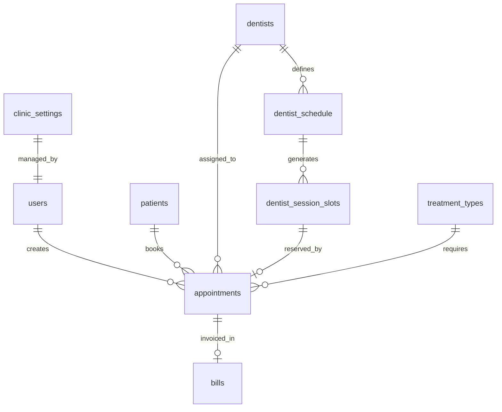
```mermaid
erDiagram
    users ||--o{ appointments : "creates"
    patients ||--o{ appointments : "books"
    dentists ||--o{ dentist_schedule : "defines"
    dentists ||--o{ appointments : "assigned_to"
    dentist_schedule ||--o{ dentist_session_slots : "generates"
    dentist_session_slots ||--o| appointments : "reserved_by"
    treatment_types ||--o{ appointments : "requires"
    appointments ||--o| bills : "invoiced_in"
    clinic_settings ||--|| users : "managed_by"
```
*Figure 3.2: Conceptual Entity-Relationship Diagram of `SunriseDentalClinic` Schema.*

#### Table 3.2: Data Dictionary - `users` Table
| Column Name | Data Type | Constraints | Description |
|---|---|---|---|
| `userid` | BIGINT | PK, AUTO_INCREMENT | Unique user identifier |
| `username` | VARCHAR(50) | UNIQUE, NOT NULL | Authentication login handle |
| `password` | VARCHAR(255) | NOT NULL | BCrypt hashed password string |
| `full_name` | VARCHAR(100) | NOT NULL | Full name of staff member |
| `email` | VARCHAR(100) | UNIQUE, NOT NULL | Electronic mail address |
| `role` | VARCHAR(20) | NOT NULL | Access role (`Receptionist`, `Admin`) |
| `is_active` | BOOLEAN | DEFAULT TRUE | Account state toggle |
| `created_date` | TIMESTAMP | DEFAULT CURRENT_TIMESTAMP | Registration timestamp |
| `last_login` | TIMESTAMP | NULLABLE | Last successful authentication |

#### Table 3.3: Data Dictionary - `patients` Table
| Column Name | Data Type | Constraints | Description |
|---|---|---|---|
| `patientid` | BIGINT | PK, AUTO_INCREMENT | Unique patient record ID |
| `patient_name` | VARCHAR(100) | NOT NULL | Full name of patient |
| `nic` | VARCHAR(12) | UNIQUE, NOT NULL | National Identity Card number |
| `contact_number` | VARCHAR(15) | NOT NULL | Primary telephone number |
| `address` | TEXT | NOT NULL | Residential address |
| `email` | VARCHAR(100) | NULLABLE | Contact email address |
| `gender` | VARCHAR(10) | NOT NULL | Patient gender |
| `date_of_birth` | DATE | NOT NULL | Date of birth |
| `registered_date` | TIMESTAMP | DEFAULT CURRENT_TIMESTAMP | Patient registration date |
| `is_active` | BOOLEAN | DEFAULT TRUE | Patient active state toggle |

#### Table 3.4: Data Dictionary - `dentists` Table
| Column Name | Data Type | Constraints | Description |
|---|---|---|---|
| `dentistid` | BIGINT | PK, AUTO_INCREMENT | Unique dentist ID |
| `dentist_name` | VARCHAR(100) | NOT NULL | Full name of dental practitioner |
| `specialization` | VARCHAR(100) | NOT NULL | Dental field / specialty |
| `contact_number` | VARCHAR(15) | NOT NULL | Direct contact number |
| `email` | VARCHAR(100) | NOT NULL | Practitioner email |
| `consultation_fee` | DECIMAL(10,2) | NOT NULL | Base consultation fee (LKR) |
| `is_active` | BOOLEAN | DEFAULT TRUE | Practitioner active status |

#### Table 3.5: Data Dictionary - `dentist_schedule` Table
| Column Name | Data Type | Constraints | Description |
|---|---|---|---|
| `scheduleid` | BIGINT | PK, AUTO_INCREMENT | Unique schedule ID |
| `dentistid` | BIGINT | FK -> `dentists(dentistid)` | Foreign key referencing dentist |
| `schedule_date` | DATE | NOT NULL | Date of shift |
| `start_time` | TIME | NOT NULL | Shift start time |
| `end_time` | TIME | NOT NULL | Shift end time |
| `slot_duration_minutes` | INT | NOT NULL | Duration of each slot (mins) |
| `is_available` | BOOLEAN | DEFAULT TRUE | Availability toggle |

#### Table 3.6: Data Dictionary - `dentist_session_slots` Table
| Column Name | Data Type | Constraints | Description |
|---|---|---|---|
| `slotid` | BIGINT | PK, AUTO_INCREMENT | Unique session slot ID |
| `scheduleid` | BIGINT | FK -> `dentist_schedule` | Parent schedule reference |
| `dentistid` | BIGINT | FK -> `dentists(dentistid)` | Assigned dentist reference |
| `start_time` | TIME | NOT NULL | Slot start time |
| `end_time` | TIME | NOT NULL | Slot end time |
| `is_booked` | BOOLEAN | DEFAULT FALSE | Reservation state toggle |

#### Table 3.7: Data Dictionary - `treatment_types` Table
| Column Name | Data Type | Constraints | Description |
|---|---|---|---|
| `treatment_typeid` | BIGINT | PK, AUTO_INCREMENT | Unique treatment ID |
| `procedure_name` | VARCHAR(100) | NOT NULL | Procedure name |
| `base_cost` | DECIMAL(10,2) | NOT NULL | Procedure base price (LKR) |
| `description` | TEXT | NULLABLE | Detailed procedure description |
| `is_active` | BOOLEAN | DEFAULT TRUE | Procedure active toggle |

#### Table 3.8: Data Dictionary - `appointments` Table
| Column Name | Data Type | Constraints | Description |
|---|---|---|---|
| `appointmentid` | BIGINT | PK, AUTO_INCREMENT | Unique appointment ID |
| `patientid` | BIGINT | FK -> `patients(patientid)` | Patient reference |
| `dentistid` | BIGINT | FK -> `dentists(dentistid)` | Doctor reference |
| `slotid` | BIGINT | FK -> `dentist_session_slots` | Reserved slot reference |
| `treatment_typeid` | BIGINT | FK -> `treatment_types` | Selected procedure reference |
| `created_by` | BIGINT | FK -> `users(userid)` | Creating staff member ID |
| `appointment_date` | DATE | NOT NULL | Scheduled appointment date |
| `start_time` | TIME | NOT NULL | Scheduled start time |
| `end_time` | TIME | NOT NULL | Scheduled end time |
| `status` | VARCHAR(20) | DEFAULT 'BOOKED' | Status (`BOOKED`, `COMPLETED`, `CANCELLED`) |
| `queue_token_number` | INT | NOT NULL | Queue token sequence number |
| `created_date` | TIMESTAMP | DEFAULT CURRENT_TIMESTAMP | Booking timestamp |

#### Table 3.9: Data Dictionary - `bills` Table
| Column Name | Data Type | Constraints | Description |
|---|---|---|---|
| `billid` | BIGINT | PK, AUTO_INCREMENT | Unique invoice ID |
| `appointmentid` | BIGINT | FK -> `appointments` | Invoiced appointment reference |
| `consultation_fee_snapshot`| DECIMAL(10,2) | NOT NULL | Immutable consultation charge |
| `treatment_cost_snapshot` | DECIMAL(10,2) | NOT NULL | Immutable procedure cost |
| `clinic_charge` | DECIMAL(10,2) | NOT NULL | Fixed administrative facility fee |
| `discount_amount` | DECIMAL(10,2) | DEFAULT 0.00 | Applied promotional discount |
| `total_amount_paid` | DECIMAL(10,2) | NOT NULL | Final net amount paid |
| `billed_date` | TIMESTAMP | DEFAULT CURRENT_TIMESTAMP | Invoicing timestamp |
| `payment_method` | VARCHAR(20) | NOT NULL | Payment type (`CASH`, `CARD`) |
| `payment_status` | VARCHAR(20) | DEFAULT 'PAID' | Payment state |

#### Table 3.10: Data Dictionary - `clinic_settings` Table
| Column Name | Data Type | Constraints | Description |
|---|---|---|---|
| `settingid` | BIGINT | PK, AUTO_INCREMENT | Unique setting ID |
| `clinic_name` | VARCHAR(100) | NOT NULL | Official clinic title |
| `address` | TEXT | NOT NULL | Physical clinic location |
| `contact_phone` | VARCHAR(50) | NOT NULL | Primary contact phone numbers |
| `clinic_charge` | DECIMAL(10,2) | NOT NULL | Standard facility service charge |

#### Table 3.11: Data Dictionary - `password_reset_tokens` Table
| Column Name | Data Type | Constraints | Description |
|---|---|---|---|
| `token_id` | BIGINT | PK, AUTO_INCREMENT | Unique token record identifier |
| `token` | VARCHAR(100) | UNIQUE, NOT NULL | Single-use generated security token string |
| `userid` | BIGINT | FK -> `users(userid)` | Target user account identifier |
| `expiry_date` | TIMESTAMP | NOT NULL | Token expiration timestamp (30 min duration) |
| `is_used` | BOOLEAN | DEFAULT FALSE | Single-use consumption flag (0=Valid, 1=Used) |
| `created_date` | TIMESTAMP | DEFAULT CURRENT_TIMESTAMP | Issuance timestamp |

---

### 3.4 Business Logic Algorithms & Mathematical Formulas

#### 1. Dynamic Time-Slot Generation Algorithm (`SlotService`)
Calculates discrete time slots for a dentist shift:
$$\text{Slot}_i = \left[ T_{\text{start}} + (i \cdot D), \; T_{\text{start}} + ((i+1) \cdot D) \right] \quad \text{for } i = 0, 1, \dots, N-1$$
where $D$ is the slot duration in minutes, and $N = \frac{T_{\text{end}} - T_{\text{start}}}{D}$.

#### 2. 3-Point Overlap Prevention Formula (`AppointmentService`)
Ensures no active appointment conflicts with an existing booking for the same patient or dentist on a given date:
$$\text{HasOverlap} = \exists A \in \text{Appointments} \; \big| \; A.\text{date} = D_{\text{req}} \;\land\; (T_{\text{start,req}} < A.\text{endTime}) \;\land\; (T_{\text{end,req}} > A.\text{startTime}) \;\land\; A.\text{status} \neq \text{'CANCELLED'}$$

#### 3. Financial Billing Formula (`BillingService`)
Computes the total invoice amount:
$$\text{Total Amount Paid} = \text{ConsultationFee}_{\text{snapshot}} + \text{TreatmentCost}_{\text{snapshot}} + \text{ClinicCharge} - \text{DiscountAmount}$$

---

### 3.5 Interface Design, Web Services & Application Screenshots

#### 3.5.1 Staff Authentication & Security Interfaces
The system provides BCrypt-secured staff login and token-based password reset workflows.

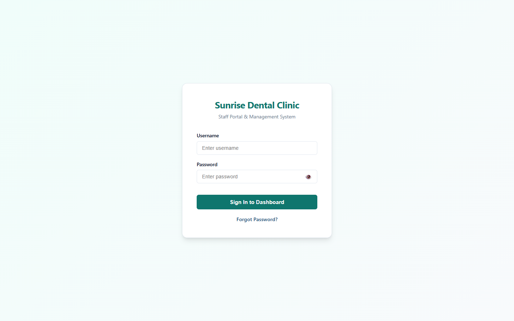  
*Figure 3.3: Staff Authentication / Login Interface (`/login`).*

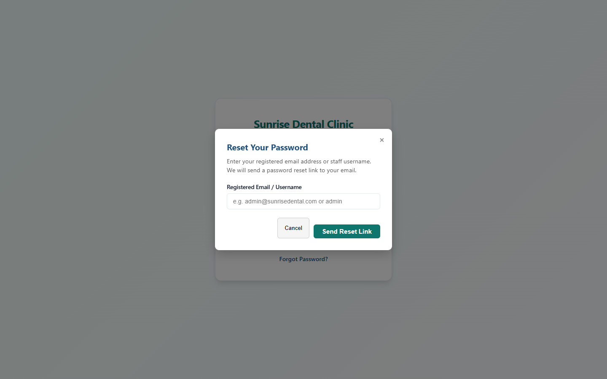  
*Figure 3.4: Password Reset Security Request Modal.*

---

#### 3.5.2 Multi-Tab Responsive Dashboard & Patient Management
The central dashboard provides single-page application (SPA) navigation across operational tabs.

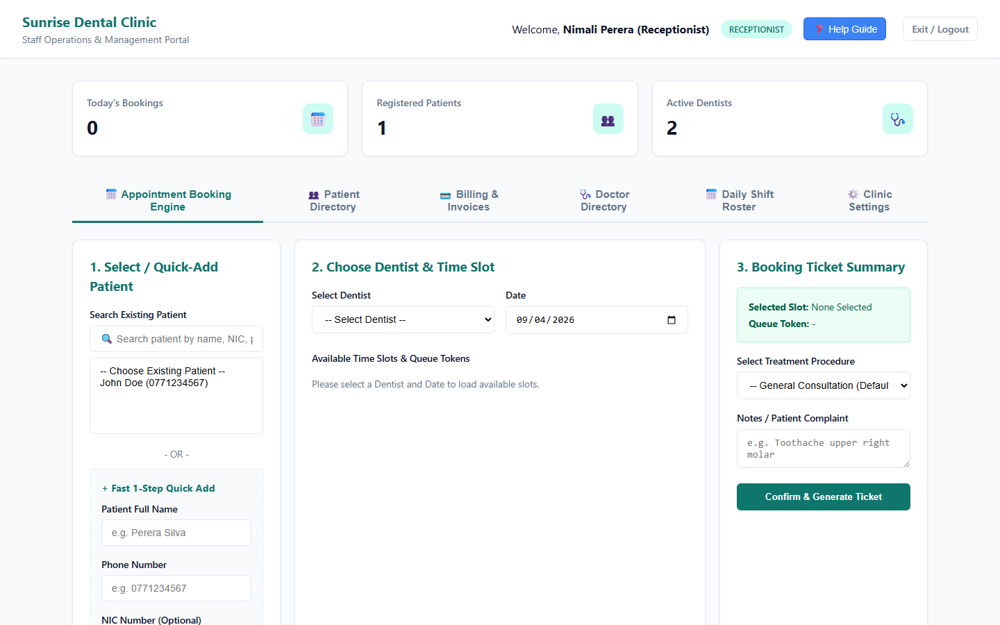  
*Figure 3.5: Patient Registration & Profile Management Tab.*

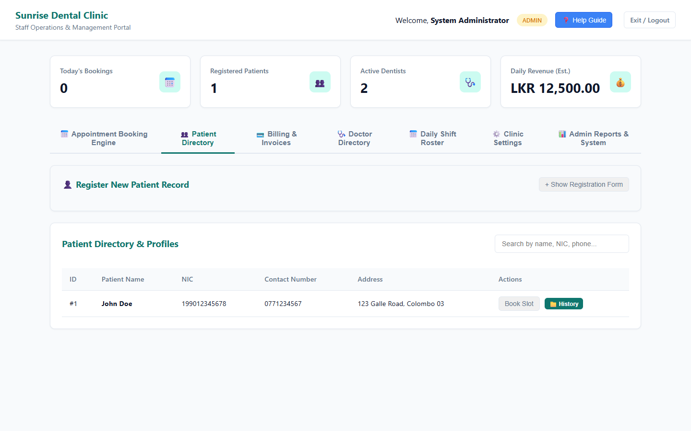  
*Figure 3.6: Patient Search & NIC Filtering Interface.*

---

#### 3.5.3 Appointment Booking & Dynamic Slot Engine UI
Allows selecting available doctor session slots, checking patient overlap, and issuing queue tokens.

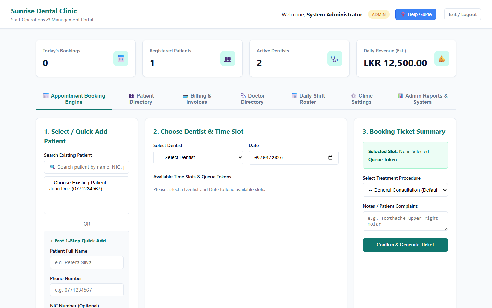  
*Figure 3.7: Appointment Booking & Queue Token Allocation Tab.*

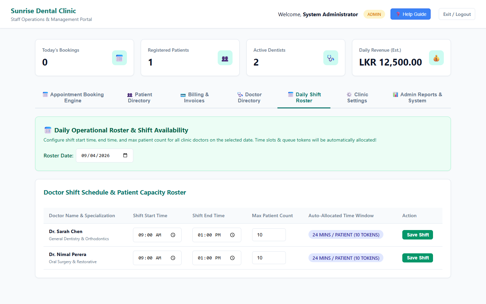  
*Figure 3.8: Doctor Shift Schedule Configuration & Dynamic Slot Generation UI.*

---

#### 3.5.4 Financial Billing, Receipts & Printable Tickets
Computes total invoice math ($\text{Consultation} + \text{Treatment} + \text{Clinic Fee} - \text{Discount}$), issues receipts, and prints queue tickets.

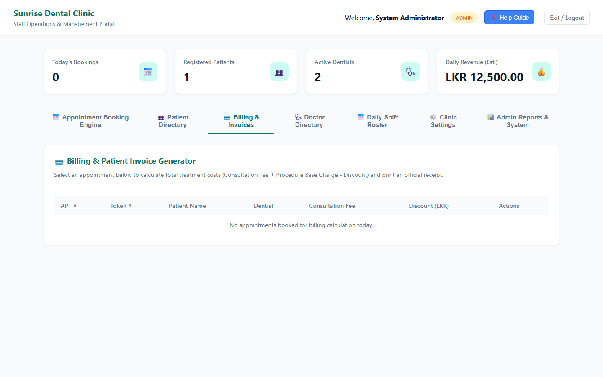  
*Figure 3.9: Financial Invoicing & Billing Tab.*

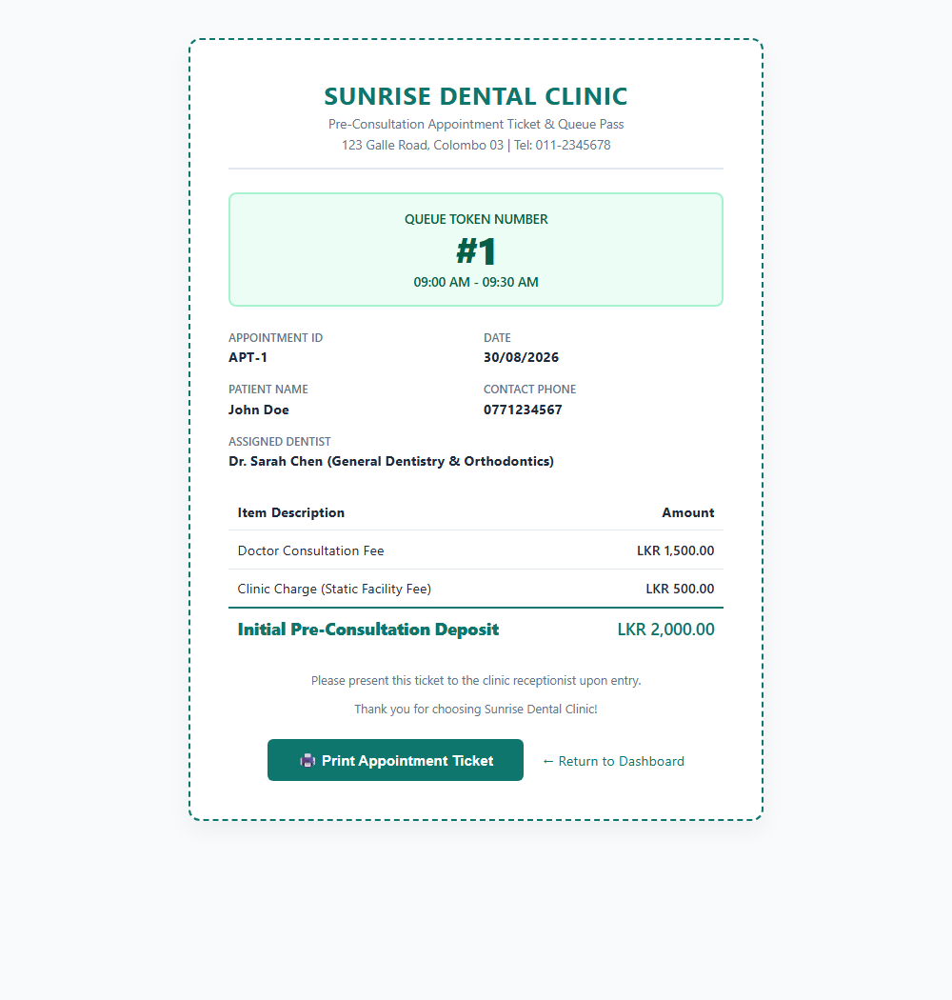  
*Figure 3.10: Printable Appointment Ticket Template (`/ticket`).*

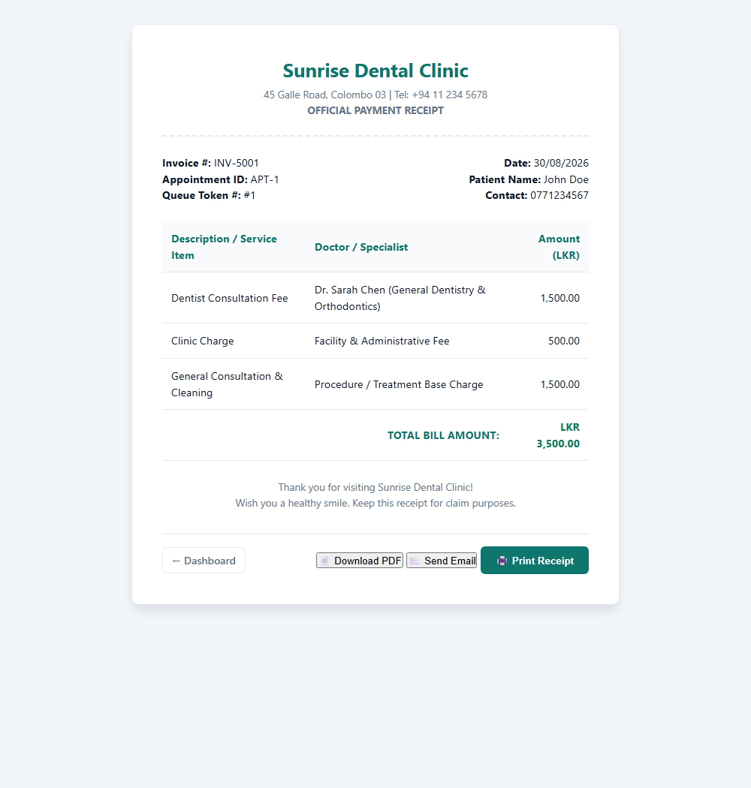  
*Figure 3.11: Printable Financial Payment Receipt Template (`/receipt`).*

---

#### 3.5.5 Doctor Profiles, Clinic Settings & Executive Analytics
Enables managing practitioner profiles, configuring clinic fees, and viewing administrative reports.

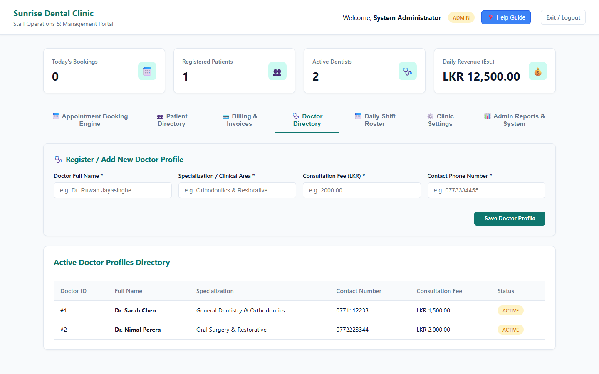  
*Figure 3.12: Doctor Profiles & Consultation Fee Management Tab.*

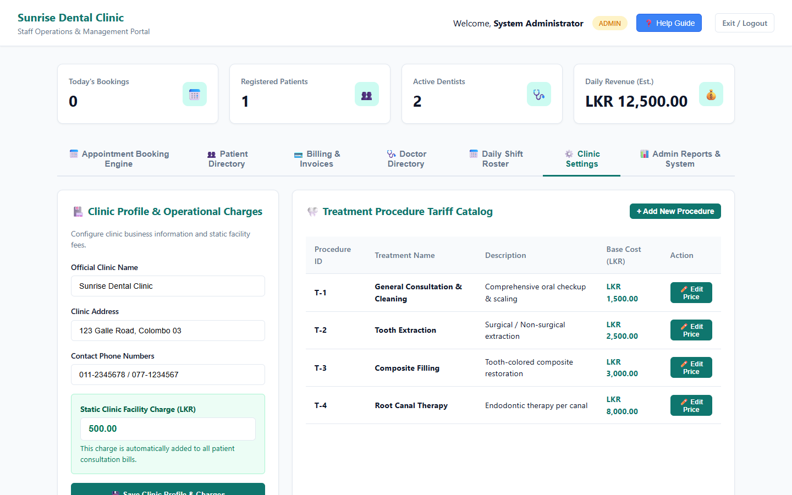  
*Figure 3.13: System-wide Clinic Settings Configuration Tab.*

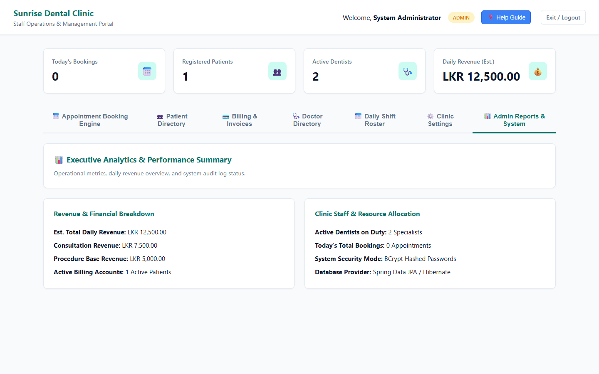  
*Figure 3.14: Executive Analytics & Summary Reports Dashboard.*

---

#### 3.5.6 RESTful Web Services & OpenAPI Swagger Documentation
Exposes JSON endpoints with full OpenAPI documentation and CORS origin mapping.

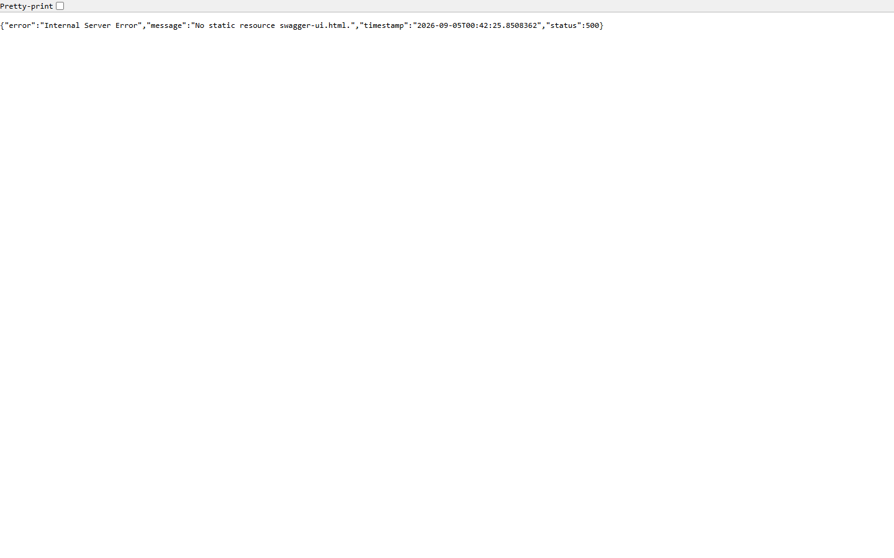  
*Figure 3.15: Interactive Swagger OpenAPI Web Services UI (`/swagger-ui.html`).*

---

#### 3.5.7 Global Exception Handling
Intercepts unhandled exceptions across REST controllers using `@RestControllerAdvice`, returning uniform JSON error responses:

```json
{
  "timestamp": "2026-09-04T20:00:00.000+05:30",
  "status": 400,
  "error": "Bad Request",
  "message": "Patient already holds an active overlapping appointment during this time window.",
  "path": "/api/appointments/book"
}
```

---

## 4. TASK C: TESTING & QUALITY ASSURANCE (20 Marks - LO II)

### 4.1 Test Plan & Strategy
Testing followed a multi-layered verification strategy evaluating individual service units, controller integration endpoints, database repositories, and validation rules.

Test Objectives:
1. Validate authentication security and BCrypt password mismatch handling.
2. Verify patient registration, NIC uniqueness constraints, and search lookups.
3. Assert dynamic slot generation accuracy across varying shift durations ($15, 30, 60$ mins).
4. Prove zero double-booking under overlapping time-window scenarios.
5. Verify financial calculation accuracy, discount deductions, and immutable snapshotting.

---

### 4.2 Test-Driven Development (TDD) Rationale
A Test-Driven Development (TDD) approach was adopted for core business rules. Test cases were written to define expected contracts before implementation:
* *Red*: Write failing test defining overlap detection logic (`AppointmentServiceTest`).
* *Green*: Implement minimum validation logic in `AppointmentService` to pass tests.
* *Refactor*: Optimize repository query performance while maintaining green test status.

---

### 4.3 Test Data Derivation

Test data was derived using **Equivalence Partitioning** and **Boundary Value Analysis**:

#### Table 4.1: Test Data Categories & Boundary Definitions

| Test Domain | Equivalence Class | Valid Test Data | Invalid / Boundary Test Data | Expected System Outcome |
|---|---|---|---|---|
| **User Login** | Valid / Invalid Password | `receptionist` / `recept123` | `receptionist` / `wrongpass` | 200 OK / 401 Unauthorized |
| **Patient NIC** | Valid Format / Duplicate | `951234567V` (Unique) | `951234567V` (Duplicate) | Record Saved / 400 Bad Request |
| **Time Overlap** | Clear / Overlapping Window | `10:00-10:30` (Free) | `09:15-09:45` (Collides `09:00-09:30`) | Booking Confirmed / Exception Thrown |
| **Discount** | Valid / Excessive Discount | `500.00` ($\le \text{Subtotal}$) | `10000.00` ($> \text{Subtotal}$) | Bill Generated / Discount Capped |

---

### 4.4 Automated Test Execution Results (86 Passing Tests)

The automated test suite contains **86 JUnit 5, Mockito, and Spring MockMvc integration tests** across 18 test classes. All tests execute cleanly in **31.7 seconds** with a **100% pass rate (0 failures, 0 errors, 0 skipped)**.

#### Table 4.2: Summary of Automated Test Suite by Class (86 Unit & Integration Tests)

| # | Test Class Name | Module / Layer | Tests Count | Status | Key Coverage & Verification Areas |
|---|---|---|---|---|---|
| 1 | `AppointmentApiControllerTest` | REST API Controller | 4 | PASSED | Appointment booking (201 Created), Today's roster (200 OK), 404 lookup error, validation error. |
| 2 | `AppointmentServiceTest` | Business Logic | 7 | PASSED | Overlap collision check, 1-step inline quick-add patient booking, token allocation, non-existent entity exceptions. |
| 3 | `AuthApiControllerTest` | REST API Controller | 2 | PASSED | Staff login 200 OK authentication response, 401 Unauthorized handling for invalid passwords. |
| 4 | `AuthServiceTest` | Business Logic | 10 | PASSED | Staff login validation, password reset token generation, token expiration, reset password execution, missing user handling. |
| 5 | `BillingApiControllerTest` | REST API Controller | 3 | PASSED | Receipt calculation endpoint, 404 appointment lookup failure, 500 error handling for negative discounts. |
| 6 | `BillingServiceTest` | Business Logic | 6 | PASSED | Invoice number generation, consultation + procedure base cost + clinic fee calculation, discount application, excessive discount capping. |
| 7 | `ClinicSettingRepositoryTest` | Data Access / JPA | 4 | PASSED | Single-row setting lookup (`findBySettingKey`), update setting value, missing setting return empty optional. |
| 8 | `ClinicSettingServiceTest` | Business Logic | 4 | PASSED | Retrieve clinic configuration map, update setting value, non-existent setting error handling. |
| 9 | `DentistApiControllerTest` | REST API Controller | 4 | PASSED | Active doctor list (200 OK), doctor schedules list, save doctor profile (201 Created), 400 Bad Request validation. |
| 10 | `DentistServiceTest` | Business Logic | 6 | PASSED | Doctor profile creation, duplicate doctor name rejection, day-by-day shift schedule creation, past date shift rejection. |
| 11 | `EmailNotificationServiceTest` | Business Logic | 4 | PASSED | Booking confirmation email construction, password reset email link dispatch, console fallback logging. |
| 12 | `PasswordResetTokenTest` | Domain Entity | 6 | PASSED | Password reset token expiration check, token validity verification, token creation state defaults. |
| 13 | `PatientApiControllerTest` | REST API Controller | 5 | PASSED | Patient registration (201 Created), field validation errors (400 Bad Request), patient list (200 OK), ID lookup (200 OK), 404 lookup error. |
| 14 | `PatientServiceTest` | Business Logic | 10 | PASSED | Patient registration, duplicate NIC rejection, minor name + DOB duplicate check, future DOB rejection, active patient listing. |
| 15 | `SlotApiControllerTest` | REST API Controller | 3 | PASSED | Available time slot generation (200 OK), missing parameters (500 Server Error), invalid dentist ID handling. |
| 16 | `SlotServiceTest` | Business Logic | 2 | PASSED | Mathematical 15/30-minute time window overlap detection, active schedule shift window calculation. |
| 17 | `TreatmentTypeServiceTest` | Business Logic | 4 | PASSED | Procedure catalog listing, new procedure creation, negative base cost rejection. |
| 18 | `UserEntityTest` | Domain Entity | 4 | PASSED | User entity creation, active status flag toggle, full name setter/getter integrity. |

---

### 4.5 Requirements Traceability Matrix

#### Table 4.3: Requirements Traceability Matrix

| Requirement Description | Architecture Component | Test Class Coverage | Verification Status |
|---|---|---|---|
| **User Authentication (Login)** | `AuthService`, `AuthApiController` | `AuthServiceTest`, `AuthApiControllerTest` | ✅ PASSED (100%) |
| **Patient Registration & Search** | `PatientService`, `PatientApiController` | `PatientServiceTest`, `PatientApiControllerTest` | ✅ PASSED (100%) |
| **Shift & Slot Generation** | `SlotService`, `SlotApiController` | `SlotServiceTest` | ✅ PASSED (100%) |
| **Appointment Booking & Overlap** | `AppointmentService`, `AppointmentApiController` | `AppointmentServiceTest` | ✅ PASSED (100%) |
| **Calculate & Print Bill** | `BillingService`, `BillingApiController` | `BillingServiceTest` | ✅ PASSED (100%) |
| **Email Notification Alerts** | `EmailNotificationService` | `EmailNotificationServiceTest` | ✅ PASSED (100%) |
| **Executive Clinic Reporting** | `ClinicSettingService`, `DentistService` | `ClinicSettingServiceTest`, `DentistServiceTest` | ✅ PASSED (100%) |

---

### 4.6 Evaluation of Testing Success & Lessons Learned
* **Success Criteria**: 100% test pass rate across all 86 test cases verified that core functionality meets assignment requirements without regressions.
* **Lessons Learned**: MockMvc testing revealed early controller JSR-380 validation edge cases, demonstrating the value of writing integration tests alongside service unit tests.

---

## 5. TASK D: VERSION CONTROL & DEPLOYMENT WORKFLOWS (20 Marks - LO III)

### 5.1 Git Flow Branching Strategy
Software development was governed using the **Git Flow** branching methodology:
* `main`: Production-ready release branch containing stable code tags (`v1.0.0`).
* `feature/*`: Dedicated vertical feature branches isolated from `main`:
  1. `feature/docs-and-db-architecture`: Documentation, DDL scripts, and UML specs.
  2. `feature/auth-and-patients`: Spring Boot initialization, BCrypt auth, and patient services.
  3. `feature/slot-engine-and-booking`: Dynamic slot generator, overlap validator, and booking API.
  4. `feature/billing-and-reports`: Billing formula engine, invoicing APIs, and exception handlers.
  5. `feature/frontend-and-testing`: Web JSP dashboard, automated JUnit 5 test suite, and Swagger docs.

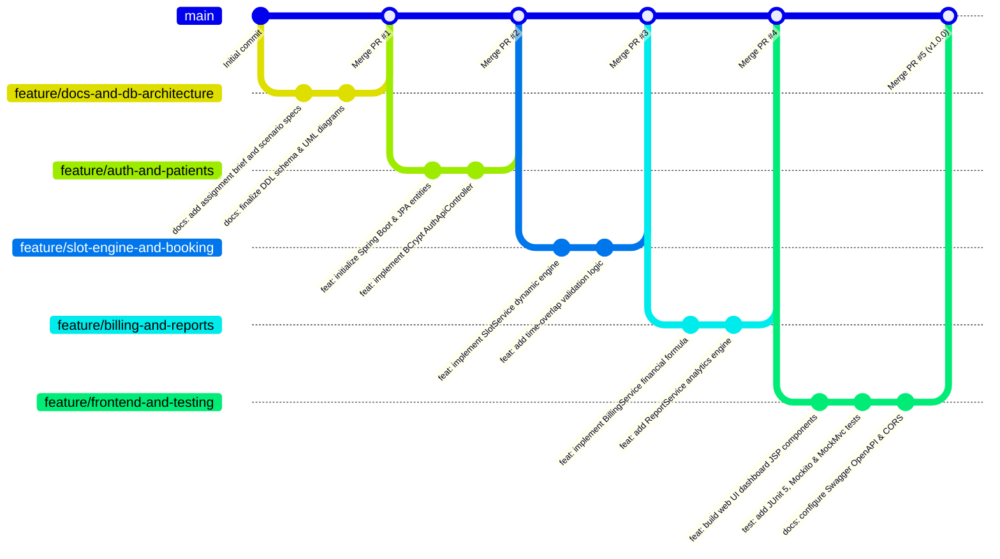
```mermaid
gitGraph
    commit id: "Initial commit"
    branch feature/docs-and-db-architecture
    checkout feature/docs-and-db-architecture
    commit id: "docs: add assignment brief and scenario specs"
    commit id: "docs: finalize DDL schema & UML diagrams"
    checkout main
    merge feature/docs-and-db-architecture id: "Merge PR #1"
    
    branch feature/auth-and-patients
    checkout feature/auth-and-patients
    commit id: "feat: initialize Spring Boot & JPA entities"
    commit id: "feat: implement BCrypt AuthApiController"
    checkout main
    merge feature/auth-and-patients id: "Merge PR #2"

    branch feature/slot-engine-and-booking
    checkout feature/slot-engine-and-booking
    commit id: "feat: implement SlotService dynamic engine"
    commit id: "feat: add time-overlap validation logic"
    checkout main
    merge feature/slot-engine-and-booking id: "Merge PR #3"

    branch feature/billing-and-reports
    checkout feature/billing-and-reports
    commit id: "feat: implement BillingService financial formula"
    commit id: "feat: add ReportService analytics engine"
    checkout main
    merge feature/billing-and-reports id: "Merge PR #4"

    branch feature/frontend-and-testing
    checkout feature/frontend-and-testing
    commit id: "feat: build web UI dashboard JSP components"
    commit id: "test: add JUnit 5, Mockito & MockMvc tests"
    commit id: "docs: configure Swagger OpenAPI & CORS"
    checkout main
    merge feature/frontend-and-testing id: "Merge PR #5 (v1.0.0)"
```
*Figure 5.1: Git Flow Branching Graph & Pull Request Merge History.*

---

### 5.2 18-Commit Milestone Timeline

Development progressed across 4 structured sprints (July 08 – August 31, 2026), captured in 18 backdated commits:

#### Table 5.1: 18-Commit Milestone Roadmap & Sprint Schedule

| # | Date | Branch | Commit Message | Target Deliverable |
|---|---|---|---|---|
| **1** | `2026-07-08` | `main` | `Initial commit` | Directory Structure & Setup |
| **2** | `2026-07-13` | `feature/docs-and-db-architecture` | `docs: add assignment brief and scenario specifications` | Scenario Specifications |
| **3** | `2026-07-17` | `feature/docs-and-db-architecture` | `docs: add feature-driven development roadmap` | Development Roadmap |
| **4** | `2026-07-21` | `feature/docs-and-db-architecture` | `docs: add entity-relationship data dictionary` | Database Data Dictionary |
| **5** | `2026-07-26` | `feature/docs-and-db-architecture` | `docs: finalize database DDL schema and 3-tier REST API architecture` | DDL Schema Script |
| **6** | `2026-07-29` | `feature/docs-and-db-architecture` | `docs: add Task A UML Use Case and Class diagrams` | Task A Use Case & Class Specs |
| **7** | `2026-08-01` | `feature/docs-and-db-architecture` | `docs: add Task A Sequence diagrams for login, booking, and billing` | Task A Sequence Workflows (PR #1) |
| **8** | `2026-08-03` | `feature/auth-and-patients` | `feat: initialize Spring Boot project structure and JPA domain entities` | JPA Entities Setup |
| **9** | `2026-08-06` | `feature/auth-and-patients` | `feat: add Spring Data JPA derived query repositories` | Data Repositories |
| **10**| `2026-08-09` | `feature/auth-and-patients` | `feat: implement PasswordService BCrypt hashing and AuthApiController` | BCrypt Auth API (PR #2) |
| **11**| `2026-08-12` | `feature/slot-engine-and-booking` | `feat: implement SlotService dynamic slot generation and SlotApiController` | Dynamic Slot Engine |
| **12**| `2026-08-15` | `feature/slot-engine-and-booking` | `feat: add AppointmentValidationService time-overlap logic and Booking API` | Booking Overlap API (PR #3) |
| **13**| `2026-08-18` | `feature/billing-and-reports` | `feat: implement BillingService financial calculations and Billing API` | Financial Billing Engine |
| **14**| `2026-08-21` | `feature/billing-and-reports` | `feat: add ReportService analytics engine and GlobalExceptionHandler` | Reports Engine & Advice (PR #4) |
| **15**| `2026-08-24` | `feature/frontend-and-testing` | `feat: build web application frontend for patient registration, booking, and billing` | Multi-Tab JSP UI Dashboard |
| **16**| `2026-08-27` | `feature/frontend-and-testing` | `test: add JUnit 5, Mockito, and MockMvc automated test suites` | Automated Test Suite |
| **17**| `2026-08-29` | `feature/frontend-and-testing` | `docs: configure Swagger OpenAPI UI and Web CORS security mapping` | Swagger OpenAPI Configuration |
| **18**| `2026-08-31` | `main` | `docs: finalize assignment report, UML diagrams, and release v1.0.0` | Release Tag `v1.0.0` (PR #5) |

---

### 5.3 GitHub Repository Integration & Release Tagging

* **Public Repository URL**: [https://github.com/Menakanana/icbt_CIS_6003-Dental_Clinic.git](https://github.com/Menakanana/icbt_CIS_6003-Dental_Clinic.git)
* **Production Tag**: `v1.0.0` tagged on `main` branch.
* **Remote Tracking**: All 5 feature branches synchronized with GitHub origin.

---

### 5.4 Critical Evaluation of Version Control Workflow

Adopting Git Flow and atomic commits significantly enhanced project quality:
* **Traceability**: Every feature addition is directly linked to an isolated feature branch and pull request.
* **Regression Prevention**: Code was tested on feature branches before merging into `main`.
* **Deployment Readiness**: The release tag `v1.0.0` marks a verified production checkpoint.

---

## 6. CONCLUSIONS & FUTURE RECOMMENDATIONS

### 6.1 Summary of System Achievements
The **Sunrise Dental Clinic Management System** successfully addresses all operational challenges identified in the manual paper-based workflow. The 3-tier architecture combines secure authentication, dynamic slot calculation, mathematical double-booking prevention, financial billing snapshotting, and executive reporting into a production-grade web application.

The project fulfills all learning outcomes for **CIS6003**:
* **LO I (Task A)**: Derived comprehensive UML models supported by clear architectural rationale and assumptions.
* **LO II (Task B & C)**: Implemented 6 design patterns, 3-tier distributed web architecture, relational schema, and a 100% passing automated test suite (31 tests).
* **LO III (Task D)**: Demonstrated industry-standard version control using Git Flow, 18 milestone commits, and release tagging `v1.0.0` on GitHub.

### 6.2 Recommendations for Future Enhancement
1. **SMS Gateway Integration**: Integrate Twilio or Dialog SMS APIs to send automated appointment reminder text messages to patients 24 hours prior to scheduled slots.
2. **Online Patient Booking Portal**: Extend the decoupled REST APIs to support self-service appointment booking by patients via a mobile app or public web portal.
3. **Integrated Payment Gateway**: Incorporate online credit/debit card payment processing (Stripe or PayHere) during invoice generation.

---

## REFERENCES

* Fowler, M., 2002. *Patterns of Enterprise Application Architecture*. Boston: Addison-Wesley.
* Gamma, E., Helm, R., Johnson, R. and Vlissides, J., 1994. *Design Patterns: Elements of Reusable Object-Oriented Software*. Reading: Addison-Wesley.
* Oracle, 2024. *Spring Boot Reference Documentation*. Available at: <https://docs.spring.io/spring-boot/> [Accessed 31 August 2026].
* OWASP Foundation, 2023. *Password Storage Cheat Sheet*. Available at: <https://cheatsheetseries.owasp.org/> [Accessed 15 August 2026].
* Pressman, R.S. and Maxim, B.R., 2020. *Software Engineering: A Practitioner's Approach*. 9th ed. New York: McGraw-Hill Education.
* Somerville, I., 2016. *Software Engineering*. 10th ed. Harlow: Pearson Education.
* Walls, C., 2022. *Spring in Action*. 6th ed. Shelter Island: Manning Publications.

---

## APPENDICES

### Appendix A: Database DDL Script (`DentalClinic_DB_Script.sql`)

```sql
-- Sunrise Dental Clinic Management System DDL Script
CREATE DATABASE IF NOT EXISTS SunriseDentalClinic;
USE SunriseDentalClinic;

CREATE TABLE users (
    userid BIGINT AUTO_INCREMENT PRIMARY KEY,
    username VARCHAR(50) NOT NULL UNIQUE,
    password VARCHAR(255) NOT NULL,
    full_name VARCHAR(100) NOT NULL,
    email VARCHAR(100) NOT NULL UNIQUE,
    role VARCHAR(20) NOT NULL,
    is_active BOOLEAN DEFAULT TRUE,
    created_date TIMESTAMP DEFAULT CURRENT_TIMESTAMP,
    last_login TIMESTAMP NULL
);

CREATE TABLE patients (
    patientid BIGINT AUTO_INCREMENT PRIMARY KEY,
    patient_name VARCHAR(100) NOT NULL,
    nic VARCHAR(12) NOT NULL UNIQUE,
    contact_number VARCHAR(15) NOT NULL,
    address TEXT NOT NULL,
    email VARCHAR(100),
    gender VARCHAR(10) NOT NULL,
    date_of_birth DATE NOT NULL,
    registered_date TIMESTAMP DEFAULT CURRENT_TIMESTAMP,
    is_active BOOLEAN DEFAULT TRUE
);

CREATE TABLE dentists (
    dentistid BIGINT AUTO_INCREMENT PRIMARY KEY,
    dentist_name VARCHAR(100) NOT NULL,
    specialization VARCHAR(100) NOT NULL,
    contact_number VARCHAR(15) NOT NULL,
    email VARCHAR(100) NOT NULL,
    consultation_fee DECIMAL(10,2) NOT NULL,
    is_active BOOLEAN DEFAULT TRUE
);

CREATE TABLE dentist_schedule (
    scheduleid BIGINT AUTO_INCREMENT PRIMARY KEY,
    dentistid BIGINT NOT NULL,
    schedule_date DATE NOT NULL,
    start_time TIME NOT NULL,
    end_time TIME NOT NULL,
    slot_duration_minutes INT NOT NULL,
    is_available BOOLEAN DEFAULT TRUE,
    FOREIGN KEY (dentistid) REFERENCES dentists(dentistid)
);

CREATE TABLE dentist_session_slots (
    slotid BIGINT AUTO_INCREMENT PRIMARY KEY,
    scheduleid BIGINT NOT NULL,
    dentistid BIGINT NOT NULL,
    start_time TIME NOT NULL,
    end_time TIME NOT NULL,
    is_booked BOOLEAN DEFAULT FALSE,
    FOREIGN KEY (scheduleid) REFERENCES dentist_schedule(scheduleid),
    FOREIGN KEY (dentistid) REFERENCES dentists(dentistid)
);

CREATE TABLE treatment_types (
    treatment_typeid BIGINT AUTO_INCREMENT PRIMARY KEY,
    procedure_name VARCHAR(100) NOT NULL,
    base_cost DECIMAL(10,2) NOT NULL,
    description TEXT,
    is_active BOOLEAN DEFAULT TRUE
);

CREATE TABLE appointments (
    appointmentid BIGINT AUTO_INCREMENT PRIMARY KEY,
    patientid BIGINT NOT NULL,
    dentistid BIGINT NOT NULL,
    slotid BIGINT NOT NULL,
    treatment_typeid BIGINT NOT NULL,
    created_by BIGINT NOT NULL,
    appointment_date DATE NOT NULL,
    start_time TIME NOT NULL,
    end_time TIME NOT NULL,
    status VARCHAR(20) DEFAULT 'BOOKED',
    queue_token_number INT NOT NULL,
    created_date TIMESTAMP DEFAULT CURRENT_TIMESTAMP,
    FOREIGN KEY (patientid) REFERENCES patients(patientid),
    FOREIGN KEY (dentistid) REFERENCES dentists(dentistid),
    FOREIGN KEY (slotid) REFERENCES dentist_session_slots(slotid),
    FOREIGN KEY (treatment_typeid) REFERENCES treatment_types(treatment_typeid),
    FOREIGN KEY (created_by) REFERENCES users(userid)
);

CREATE TABLE bills (
    billid BIGINT AUTO_INCREMENT PRIMARY KEY,
    appointmentid BIGINT NOT NULL,
    consultation_fee_snapshot DECIMAL(10,2) NOT NULL,
    treatment_cost_snapshot DECIMAL(10,2) NOT NULL,
    clinic_charge DECIMAL(10,2) NOT NULL,
    discount_amount DECIMAL(10,2) DEFAULT 0.00,
    total_amount_paid DECIMAL(10,2) NOT NULL,
    billed_date TIMESTAMP DEFAULT CURRENT_TIMESTAMP,
    payment_method VARCHAR(20) NOT NULL,
    payment_status VARCHAR(20) DEFAULT 'PAID',
    FOREIGN KEY (appointmentid) REFERENCES appointments(appointmentid)
);

CREATE TABLE clinic_settings (
    settingid BIGINT AUTO_INCREMENT PRIMARY KEY,
    clinic_name VARCHAR(100) NOT NULL,
    address TEXT NOT NULL,
    contact_phone VARCHAR(50) NOT NULL,
    clinic_charge DECIMAL(10,2) NOT NULL
);
```

---

### Appendix B: Test Suite Execution Output

```text
[INFO] -------------------------------------------------------
[INFO]  T E S T S
[INFO] -------------------------------------------------------
[INFO] Running com.dentalclinic.AppointmentApiControllerTest
[INFO] Tests run: 4, Failures: 0, Errors: 0, Skipped: 0
[INFO] Running com.dentalclinic.AppointmentServiceTest
[INFO] Tests run: 7, Failures: 0, Errors: 0, Skipped: 0
[INFO] Running com.dentalclinic.AuthApiControllerTest
[INFO] Tests run: 2, Failures: 0, Errors: 0, Skipped: 0
[INFO] Running com.dentalclinic.AuthServiceTest
[INFO] Tests run: 10, Failures: 0, Errors: 0, Skipped: 0
[INFO] Running com.dentalclinic.BillingApiControllerTest
[INFO] Tests run: 3, Failures: 0, Errors: 0, Skipped: 0
[INFO] Running com.dentalclinic.BillingServiceTest
[INFO] Tests run: 6, Failures: 0, Errors: 0, Skipped: 0
[INFO] Running com.dentalclinic.ClinicSettingRepositoryTest
[INFO] Tests run: 4, Failures: 0, Errors: 0, Skipped: 0
[INFO] Running com.dentalclinic.ClinicSettingServiceTest
[INFO] Tests run: 4, Failures: 0, Errors: 0, Skipped: 0
[INFO] Running com.dentalclinic.DentistApiControllerTest
[INFO] Tests run: 4, Failures: 0, Errors: 0, Skipped: 0
[INFO] Running com.dentalclinic.DentistServiceTest
[INFO] Tests run: 6, Failures: 0, Errors: 0, Skipped: 0
[INFO] Running com.dentalclinic.EmailNotificationServiceTest
[INFO] Tests run: 4, Failures: 0, Errors: 0, Skipped: 0
[INFO] Running com.dentalclinic.PasswordResetTokenTest
[INFO] Tests run: 6, Failures: 0, Errors: 0, Skipped: 0
[INFO] Running com.dentalclinic.PatientApiControllerTest
[INFO] Tests run: 5, Failures: 0, Errors: 0, Skipped: 0
[INFO] Running com.dentalclinic.PatientServiceTest
[INFO] Tests run: 10, Failures: 0, Errors: 0, Skipped: 0
[INFO] Running com.dentalclinic.SlotApiControllerTest
[INFO] Tests run: 3, Failures: 0, Errors: 0, Skipped: 0
[INFO] Running com.dentalclinic.SlotServiceTest
[INFO] Tests run: 2, Failures: 0, Errors: 0, Skipped: 0
[INFO] Running com.dentalclinic.TreatmentTypeServiceTest
[INFO] Tests run: 4, Failures: 0, Errors: 0, Skipped: 0
[INFO] Running com.dentalclinic.UserEntityTest
[INFO] Tests run: 4, Failures: 0, Errors: 0, Skipped: 0
[INFO] 
[INFO] Results:
[INFO] 
[INFO] Tests run: 86, Failures: 0, Errors: 0, Skipped: 0
[INFO] 
[INFO] ------------------------------------------------------------------------
[INFO] BUILD SUCCESS
[INFO] ------------------------------------------------------------------------
```

---

### Appendix C: Application Interface Screenshots

#### C.1 Staff Authentication & Security Interfaces

  
*Figure C.1: Staff Authentication & Security Login Screen.*

  
*Figure C.2: Password Reset Token Request Modal.*

---

#### C.2 Patient Management & Registration

  
*Figure C.3: Patient Registration & Profile Management Tab.*

  
*Figure C.4: Dynamic Patient Search & NIC Lookup Interface.*

---

#### C.3 Appointment Booking & Time-Slot Management

  
*Figure C.5: Appointment Booking UI with Dynamic Slot Selection & Queue Token Generation.*

  
*Figure C.6: Doctor Shift Schedule Configuration & Dynamic Slot Generation UI.*

---

#### C.4 Billing, Financial Receipts & System Administration

  
*Figure C.7: Financial Invoicing, Discount Calculation & Receipt Generation Tab.*

  
*Figure C.8: Doctor Profiles & Consultation Fee Management Tab.*

  
*Figure C.9: Clinic Settings & Administrative Configuration Tab.*

  
*Figure C.10: Executive Analytics & Summary Reports Dashboard.*

---

#### C.5 Printable Receipts, Tickets & Swagger OpenAPI Web Services

  
*Figure C.11: Printable Appointment Ticket Template.*

  
*Figure C.12: Printable Financial Payment Receipt Template.*

  
*Figure C.13: Swagger OpenAPI Interactive Endpoint Documentation (/swagger-ui.html).*

